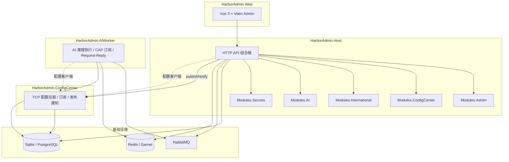

# HarborAdmin

一套面向中后台场景的 .NET 模块化管理框架

[frontend](https://github.com/NorthHarborLab/HarborAdmin.Web)
.NET 10
FreeSql
CAP RabbitMQ
Vue 3 Vben

HarborAdmin project overview

## 项目介绍

HarborAdmin 是一套面向中后台场景的 .NET 管理框架：**封装克制、结构清晰、可单体可拆分运行**。

项目采用 Modular Monolith（模块化单体）作为默认架构，业务按模块垂直切分，Host 只做组合根；配置中心、AI Worker 等能力可以作为独立进程运行。配套前端项目为 [NorthHarborLab/HarborAdmin.Web](https://github.com/NorthHarborLab/HarborAdmin.Web)，基于 Vue Vben Admin 构建管理端体验。

HarborAdmin 不只提供配置、权限、国际化、缓存、密钥等中后台基础能力，也把 AI 业务作为一等公民：支持供应商与模型管理、Prompt、知识库、结构化输出、工具配置、发布热加载、配额与调用观测；后续会继续演进可视化业务流与 AI 操作员。

## 适用场景

- 中小团队快速搭建管理后台、运营后台、内部管理系统。
- 需要保持单体开发效率，同时预留配置中心、AI Worker 等独立进程演进空间的项目。
- 需要配置中心、国际化、缓存、密钥、事件总线等基础设施能力的 .NET 项目。
- 希望在中后台流程中接入 AI 工具、知识库、结构化输出、AI 审核/摘要/翻译等能力的业务系统。

## 项目组成

| 仓库                                                                     | 说明                                                     |
| ------------------------------------------------------------------------ | -------------------------------------------------------- |
| **HarborAdmin**                                                          | 后端源码：模块化单体 + 可独立进程（配置中心、AI Worker） |
| **[HarborAdmin.Web](https://github.com/NorthHarborLab/HarborAdmin.Web)** | 前端源码：Vue 3 + Vben Admin 管理端                      |

### 后端工程结构

```text
HarborAdmin/
  buildingBlocks/          # 可复用基础设施
  modules/                 # 业务模块
  services/                # 可执行进程
  client/                  # 对外客户端 SDK
  docs/                    # 设计备忘与规划文档
  docker-compose.infra.yml # RabbitMQ / Redis / Garnet
```

| 目录              | 说明                                                                   |
| ----------------- | ---------------------------------------------------------------------- |
| `buildingBlocks/` | Abstractions、Data、Caching、EventBus、Mapping、Secrets 等基础设施     |
| `modules/`        | Admin、ConfigCenter、International、AI、Secrets 等业务模块             |
| `services/`       | `HarborAdmin.Host`、`HarborAdmin.ConfigCenter`、`HarborAdmin.AIWorker` |
| `client/`         | 配置中心客户端、AI 客户端                                              |
| `docs/`           | 功能规划、动态管理、设计备忘与图片资产                                 |

每个业务模块遵循统一目录：

```text
HarborAdmin.Modules.{Name}/
  Domain/           # 实体、领域规则
  Application/      # 应用服务
  Contracts/        # DTO、请求/响应、跨模块契约
  Infrastructure/   # FreeSql、外部适配
  Controllers/      # HTTP API，由 Host 加载
```

## 功能概览

| 模块              | 职责             | 典型能力                                                                        |
| ----------------- | ---------------- | ------------------------------------------------------------------------------- |
| **Admin**         | 管理后台核心业务 | 登录/验证码、RBAC、菜单/角色/用户/部门、功能设计元数据、动态 CRUD、缓存运维 API |
| **ConfigCenter**  | 配置中心管理面   | 应用/环境/配置项 CRUD、发布快照、版本历史                                       |
| **International** | 国际化           | 页面/词条管理、运行时语言包、AI 翻译回调订阅                                    |
| **AI**            | AI 平台管理面    | 供应商与模型、Prompt、知识库、AI 业务、配置发布、配额、调用观测、管理端对话     |
| **Secrets**       | 密钥管理         | 密钥版本、启用/禁用，供 AI 签名等场景引用                                       |

### 当前可用能力

| 领域       | 功能                                                                                |
| ---------- | ----------------------------------------------------------------------------------- |
| 配置中心   | 多应用/多环境配置项、发布快照、TCP 客户端拉取与热更新                               |
| 国际化     | 页面与词条管理、运行时 Bundle、与 AI 翻译联动                                       |
| 权限与系统 | 登录、Token、验证码、用户/角色/菜单/部门、API 级鉴权、字段策略                      |
| 动态能力   | 功能设计工作台、运行时 Schema、动态 CRUD 数据通道                                   |
| 缓存       | 强类型缓存模型、Tag 失效、Redis/Garnet、管理端分组查看与清理                        |
| 密钥       | 密钥与版本管理、模块内安全引用                                                      |
| AI 平台    | 供应商/模型、Prompt、知识库、Business 配置、发布热加载、配额、调用日志、管理端 Chat |
| 事件总线   | CAP + RabbitMQ、集成事件发布、AI 配置发布通知、Request/Reply（Redis）               |

### 功能规划状态

- [x] 配置中心（已完成）：配置管理、发布与客户端拉取。
- [x] 国际化统一配置（已完成）：前端运行时语言包与后台管理。
- [x] 缓存管理（已完成）：缓存查看、刷新、删除与诊断。
- [x] 多类型验证码（已完成）：图片、滑块、短信、邮箱等验证码能力。
- [ ] 资源设计（进行中）：管理 Admin 静态与动态页面、接口策略、按钮权限、字段策略、前端视图与权限点配置。
- [x] AI 供应商（已完成）：供应商、模型、路由、配额与调用配置管理。
- [x] AI Prompt（已完成）：Prompt 管理、结构化输出与业务绑定能力。
- [x] AI 知识库（已完成）：知识库管理、业务绑定与运行时检索配置。
- [x] AI 业务（已完成）：Business 配置、工具选项、供应商路由、发布热加载。
- [x] AI 调用观测（已完成）：调用日志、用量流水、配额消耗与管理端 Chat。
- [ ] AI 工具（进行中）：工具声明、工具参数、工具轮次与调用约束。
- [ ] AI 业务流设计（未开始）：拖拽式节点配置、流程编排、导入导出与预览。
- [ ] AI 业务员（未开始）：面向具体岗位的 AI 操作员、任务队列与流程协作。
- [ ] 菜单管理（未开始）：迁移前端菜单展示策略。
- [ ] 角色管理（未开始）：权限点、接口策略、字段策略、前端视图与权限点配置。
- [ ] 部门管理（未开始）：组织架构、上下级部门与人员归属。
- [ ] 用户管理（未开始）：用户档案、账号状态与登录安全。
- [ ] 数据字典（未开始）：字典类型、字典项与业务枚举配置。
- [ ] 定时任务（未开始）：任务编排、执行记录与失败重试。
- [ ] 日志聚合（未开始）：集中采集、检索与聚合分析。
- [ ] 日志管理（未开始）：操作日志、登录日志、异常日志。
- [ ] 站内信（未开始）：站内通知、消息投递与已读状态。
- [ ] 内部 IM（未开始）：用户即时通讯与群组能力。
- [ ] 客服坐席（未开始）：坐席分配、会话处理与服务记录。
- [ ] 客服组件（未开始）：可嵌入任意页面的客服会话、消息投递与已读状态。
- [ ] 数据大屏（未开始）：动态数据源与可视化图表配置。
- [ ] 报表导出（未开始）：动态 SQL 查询数据的 Excel 导出。
- [ ] 系统监控（未开始）：项目运行系统状态查看。
- [ ] 服务监控（未开始）：CAP 链路监控。

权限管理模块后续会覆盖菜单、按钮、列、数据权限、接口日志策略、前端视图与权限点配置；模块开关会用于控制单体应用下的前端行为，例如关闭国际化模块后前端不再下载翻译数据。

### AI 未来规划

AI 模块后续会从“模型调用与配置管理”继续演进到可配置的 **AI 业务员**。AI 业务员会绑定岗位、权限、知识库、模型路由和工具集，在审批、客服、运营、翻译、报表、配置巡检等场景中作为可审计、可人工接管的 AI 操作员参与业务流程。

| 方向       | 能力                                                                 |
| ---------- | -------------------------------------------------------------------- |
| 业务员档案 | 名称、岗位、职责范围、默认 Prompt、知识库、模型与供应商路由          |
| 权限边界   | 菜单、接口、数据范围、字段策略和可调用工具                           |
| 任务队列   | 人工派单、系统事件触发、定时任务触发、流程节点触发                   |
| 工具调用   | 调用内部 API、查询数据、生成报表、发送站内信或执行业务动作           |
| 流程协作   | 审批建议、自动填表、摘要、翻译、质检、风险提示                       |
| 审计观测   | 输入、检索上下文、工具调用、模型输出、人工干预、耗时、费用与业务结果 |

## 启动项目

### 环境要求

- .NET 10 SDK
- Node.js 20+、pnpm（前端）
- Docker（RabbitMQ；Redis/Garnet 按需）

### 启动基础设施

```bash
# RabbitMQ 管理台 http://localhost:15672  guest/guest
docker compose -f docker-compose.infra.yml up -d

# 可选：Redis 或 Garnet（缓存 / AI Request-Reply）
docker compose -f docker-compose.infra.yml --profile redis up -d
```

### 启动后端

```bash
# 1. 配置中心（TCP）
cd services/HarborAdmin.ConfigCenter
dotnet run

# 2. 管理 Host（HTTP）
cd ../HarborAdmin.Host
dotnet run

# 3. 可选：AI Worker
cd ../HarborAdmin.AIWorker
dotnet run
```

| 进程                       | 默认协议/端口  | 职责                                   |
| -------------------------- | -------------- | -------------------------------------- |
| `HarborAdmin.Host`         | HTTP `50001`   | 管理 API 组合根                        |
| `HarborAdmin.ConfigCenter` | TCP `50000`    | 只读配置服务：拉取、订阅、接收发布通知 |
| `HarborAdmin.AIWorker`     | HTTP（可配置） | AI 调用执行、配额、工具轮次、CAP 回调  |

### 启动前端

前端项目地址：[NorthHarborLab/HarborAdmin.Web](https://github.com/NorthHarborLab/HarborAdmin.Web)

```bash
git clone https://github.com/NorthHarborLab/HarborAdmin.Web.git
cd HarborAdmin.Web
pnpm install
pnpm dev:admin
```

## 技术架构



### 关键设计约定

- **模块化单体优先**：业务逻辑与 Controller 放在模块内，Host 只做组合根。
- **跨模块只走 Contracts**：禁止跨模块引用其他模块的 `Domain` / `Infrastructure`。
- **配置中心走 TCP 协议**：发布链路为 Host 写快照 -> TCP 通知 ConfigCenter -> 客户端收到 `configChanged`。
- **业务解耦走 CAP + RabbitMQ**：如 AI 配置发布、翻译回调、后续业务事件。
- **缓存失效保持基础设施边界**：Host 桥接 FreeSql `CurdAfter` 与 Caching，Data 与 Caching 互不引用。

## 技术栈

### 后端

| 技术               | 用途                    |
| ------------------ | ----------------------- |
| .NET 10            | 应用运行时与 Web API    |
| FreeSql            | ORM、多库、CodeFirst    |
| DotNetCore.CAP     | 分布式事务消息 / Outbox |
| RabbitMQ           | CAP 消息中间件          |
| Redis / Garnet     | 缓存、AI Request/Reply  |
| Mapster            | 对象映射                |
| Yitter.IdGenerator | 雪花 ID                 |
| SkiaSharp          | 验证码图片渲染          |

### 前端

| 技术       | 用途                 |
| ---------- | -------------------- |
| Vue 3      | 管理端 UI            |
| Vben Admin | 中后台模板与基础能力 |
| TypeScript | 类型系统             |
| Vite       | 前端构建工具         |
| pnpm       | 依赖管理             |

## 使用示例

### Host 注册模块与基础设施

```csharp
builder.Services.AddHarborFreeSql(builder.Configuration.GetSection(DbConfig.SectionName), options =>
{
    options.SnowflakeWorkerId = configuration.GetValue<ushort?>("Harbor:YitterWorkId") ?? 1;
    options.AddCurdAfterHandler(CacheInvalidationAopBridge.Dispatch);
});

builder.Services.AddHarborCaching(builder.Configuration.GetSection(HarborCacheOptions.SectionName));

builder.Services
    .AddHarborCap(builder.Configuration, cap => cap.DefaultGroupName = "harbor.admin.host")
    .AddHarborCapSubscribers(typeof(InternationalTranslationSubscriber).Assembly);

builder.Services.AddAdminModule();
builder.Services.AddInternationalModule();
builder.Services.AddConfigCenterModule(builder.Configuration);
builder.Services.AddAiModule(builder.Configuration);
builder.Services.AddSecretsModule(builder.Configuration);
```

### 多库实体声明

```csharp
[DbKey("AdminDb")]
public sealed class AdminUser : AuditableEntity
{
    public string UserName { get; set; } = string.Empty;
}
```

多库时实体应显式声明 `[DbKey]`，且与 `Harbor:DbConfig:Databases` 中的 `Key` 一致。

### 配置中心发布

```http
POST /api/admin/config-center/{appId}/{env}/publish
```

发布后 ConfigCenter 进程通过 TCP 刷新缓存，已连接的业务客户端收到 `configChanged`。

## 参与与许可

HarborAdmin 仍在积极演进。欢迎通过 Issue 与 PR 参与；原则上保持模块边界与组合根职责不被破坏。

许可证以各子项目及前端模板原有许可为准（前端基于 MIT 的 Vue Vben Admin）。
