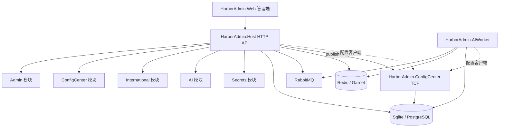

# ⚓ HarborAdmin

**✦ AI Agent 时代的小团队业务控制台。**

HarborAdmin 是一个面向独立开发者、小团队和一人公司的现代化中后台开源框架。它把用户、权限、菜单、配置、缓存、国际化、日志、AI 平台和未来的 AI 业务员能力沉淀成一套可长期复用的业务底座。

[前端项目 HarborAdmin.Web](https://github.com/NorthHarborLab/HarborAdmin.Web)  
.NET 10 / Vue 3 / Vben Admin / FreeSql / CAP / RabbitMQ / Redis

`◆ Modular Monolith` `◆ ConfigCenter` `◆ Runtime i18n` `◆ AI Platform` `◆ AI Worker`


## ✦ 一句话定位

HarborAdmin 不是一个“后台模板”，而是一套面向真实业务增长的后台产品底座。

它的目标是让小团队不用每个项目都从零搭后台，而是把可复用的业务控制能力持续沉淀下来：从账号、权限、菜单、组织，到配置中心、缓存运维、国际化，再到 AI Prompt、知识库、工具调用和 AI 业务员。

## ◈ 为什么需要 HarborAdmin？

独立开发者和小团队常见的问题不是不会写后台，而是每个项目都在重复消耗时间：

- 重新做用户、角色、权限和菜单。
- 重新写组织架构、数据字典、系统配置。
- 重新补操作日志、登录日志、缓存管理。
- 重新接入配置中心、国际化和基础运维页面。
- 重新配置 AI 模型、Prompt、知识库和工具调用。
- 业务增长后，又要重新梳理模块边界和演进路径。

HarborAdmin 试图把这些“每次都要写，但每次都不该重新写”的东西变成一个可复用、可演进、可扩展的业务控制台。

## ✧ 产品主张

### 01 · 先服务小团队

HarborAdmin 优先服务独立开发者、小团队和一人公司。它不追求一开始就变成庞大的企业级平台，而是先把小团队最常见、最容易重复建设的后台能力做好。

### 02 · 先保持单体效率

默认采用 Modular Monolith（模块化单体）。业务按模块垂直切分，Host 只做组合根。你可以先用单体的开发效率推进产品，也可以在需要时把配置中心、AIWorker 等能力拆成独立进程。

### 03 · 先沉淀业务控制台

HarborAdmin 关注的不只是页面和组件，而是后台真正要控制的东西：权限边界、配置变更、运行状态、业务数据、流程节点、AI Agent 的动作范围。

### 04 · 面向 AI Agent 时代

AI 不应该只是一个聊天入口。HarborAdmin 希望把 AI Agent 放进业务后台里，让它有岗位、权限、知识库、工具、任务队列和审计记录，成为可控、可追踪、可人工接管的 AI 业务员。

## ◎ 适合谁？

- 正在做 SaaS 的独立开发者。
- 想快速搭建 MVP 的一人公司。
- 做企业内部系统、运营后台、管理后台的小团队。
- 想把 AI Agent 接入真实业务流程的开发者。
- 想学习 .NET + Vue 现代中后台架构的人。
- 想把通用后台能力沉淀为长期资产的团队。

## × 不适合谁？

- 只想找一个纯前端 Admin 模板的人。
- 不想理解业务架构、只想复制粘贴的人。
- 只需要一次性项目脚手架、不打算长期维护的人。
- 一开始就需要超大型集团级复杂治理体系的项目。

## ◇ 核心能力

### ▣ 业务后台底座

HarborAdmin 提供中后台项目最常见的基础能力，让新项目不用重复造轮子。

- 用户、角色、菜单、部门等后台基础模型。
- 登录、Token、验证码、API 鉴权。
- 菜单权限、按钮权限、字段策略、数据权限规划。
- 动态 CRUD 与运行时 Schema。
- 操作日志、登录日志、异常日志规划。
- 数据字典、定时任务、系统监控规划。

### ▣ 配置中心

配置中心是 HarborAdmin 的核心基础设施之一，用于管理多应用、多环境配置和发布流程。

- 多应用、多环境配置管理。
- 配置项 CRUD 与发布快照。
- TCP 客户端拉取与热更新。
- Host 发布后通知 ConfigCenter 刷新缓存。
- 业务服务只配置 ConfigCenter 地址，其余配置由配置中心下发。

### ▣ 国际化与缓存

让后台具备运行时国际化和可运维的缓存能力。

- 页面与词条管理。
- 前端运行时语言包 Bundle。
- AI 翻译联动规划。
- 强类型缓存模型。
- Redis / Garnet 缓存支持。
- Tag 失效与管理端缓存运维入口。

### ▣ AI 平台

HarborAdmin 把 AI 能力纳入后台管理，而不是散落在业务代码里。

- AI 供应商与模型管理。
- Prompt 管理。
- 知识库管理。
- AI Business 配置。
- 结构化输出配置。
- 工具选项与最大工具轮次配置。
- 供应商路由与配额控制。
- 配置发布与 AIWorker 热加载。
- 调用日志、用量流水和管理端 Chat。

## ✦ AI 业务员愿景

未来的小团队不会只需要“后台页面”，还会需要能参与业务流程的 AI Agent。

HarborAdmin 规划中的 AI Agent 不是一个无边界聊天框，而是面向具体岗位的 **AI 业务员**。它绑定岗位、权限、知识库、模型路由和可调用工具，在业务系统允许的范围内完成任务。

典型场景：

- 客服业务员：读取知识库、回复用户、生成服务记录、必要时转人工。
- 运营业务员：生成站内信、整理活动数据、输出报表摘要。
- 审核业务员：辅助判断内容、订单、资料或流程是否需要人工复核。
- 翻译业务员：识别页面词条、调用模型翻译、回写国际化资源。
- 运维业务员：巡检配置、缓存、CAP 链路和系统状态，给出处理建议。

AI 业务员应该可审计、可回放、可人工接管，而不是绕过业务系统直接操作数据。

### AI 业务员能力规划

- [ ] 业务员档案：名称、岗位、职责范围、默认 Prompt、知识库、模型与供应商路由。
- [ ] 权限边界：菜单、接口、数据范围、字段策略和可调用工具。
- [ ] 任务队列：人工派单、系统事件触发、定时任务触发、流程节点触发。
- [ ] 工具调用：调用内部 API、查询数据、生成报表、发送站内信或执行业务动作。
- [ ] 流程协作：审批建议、自动填表、摘要、翻译、质检、风险提示。
- [ ] 人工接管：关键动作支持确认、驳回、重试和人工补充上下文。
- [ ] 审计观测：记录输入、检索上下文、工具调用、模型输出、人工干预、耗时、费用和业务结果。

## ◈ 为什么不是普通 Admin 模板？

普通 Admin 模板通常回答的是：“页面怎么长得好看？”

HarborAdmin 更想回答的是：

- 业务模块如何长期演进？
- 后台基础能力如何跨项目复用？
- 配置、缓存、权限、日志、国际化如何成为平台能力？
- AI Agent 如何在权限边界内参与业务流程？
- 小团队如何在不拆成一堆微服务的情况下保留可演进空间？

所以 HarborAdmin 的重点不是“再做一套页面模板”，而是把中后台系统里的稳定能力、业务边界和 AI Agent 控制能力组合成一个产品化底座。

## ◇ 产品模块

| 模块 | 产品价值 |
| --- | --- |
| ▣ Admin | 管理后台核心：账号、权限、菜单、组织、动态管理能力 |
| ◆ ConfigCenter | 配置中心：多环境配置、发布快照、客户端热更新 |
| ✦ International | 国际化：页面词条、运行时语言包、AI 翻译联动 |
| ◇ AI | AI 平台：供应商、模型、Prompt、知识库、Business、工具与观测 |
| ◈ Secrets | 密钥管理：密钥版本、启用禁用、安全引用 |
| ✧ AIWorker | AI 执行进程：配置热加载、调用执行、配额与回调 |

## ◎ 项目组成

| 仓库 | 说明 |
| --- | --- |
| HarborAdmin | 后端源码：模块化单体 + 配置中心 + AIWorker |
| [HarborAdmin.Web](https://github.com/NorthHarborLab/HarborAdmin.Web) | 前端源码：Vue 3 + Vben Admin 管理端 |

```text
HarborAdmin/
  buildingBlocks/          # 可复用基础设施
  modules/                 # 业务模块
  services/                # 可执行进程
  client/                  # 对外客户端 SDK
  docs/                    # 设计备忘与规划文档
  docker-compose.infra.yml # RabbitMQ / Redis / Garnet
```

## ◈ 架构概览



## ✦ 开发路线图

完整规划见 [docs/feature-memo.md](./docs/feature-memo.md)。

- [x] 配置中心（已完成）：配置管理、发布与客户端拉取。
- [x] 国际化统一配置（已完成）：前端运行时语言包与后台管理。
- [x] 缓存管理（已完成）：缓存查看、刷新、删除与诊断。
- [x] 多类型验证码（已完成）：图片、滑块、短信、邮箱等验证码能力。
- [x] 资源设计（已完成）：管理 Admin 静态与动态页面、接口策略、按钮权限、字段策略、前端视图与权限点配置。
- [x] AI 供应商（已完成）：供应商、模型、路由、配额与调用配置管理。
- [x] AI Prompt（已完成）：Prompt 管理、结构化输出与业务绑定能力。
- [x] AI 知识库（已完成）：知识库管理、业务绑定与运行时检索配置。
- [x] AI 业务（已完成）：Business 配置、工具选项、供应商路由、发布热加载。
- [x] AI 调用观测（已完成）：调用日志、用量流水、配额消耗与管理端 Chat。
- [x] 菜单管理（已完成）：迁移前端菜单展示策略。
- [x] 角色管理（已完成）：权限点、接口策略、字段策略、前端视图与权限点配置。
- [x] 部门管理（已完成）：组织架构、上下级部门与人员归属。
- [x] 用户管理（已完成）：用户档案、账号状态与登录安全。
- [x] 数据字典（已完成）：字典类型、字典项与业务枚举配置。
- [ ] 定时任务（进行中）：任务编排、执行记录与失败重试。
- [ ] 报表导出（未开始）：动态 SQL 查询数据的 Excel 导出。
- [ ] 系统监控（未开始）：项目运行系统状态查看。
- [ ] 日志聚合（未开始）：集中采集、检索与聚合分析。
- [ ] 日志管理（未开始）：操作日志、登录日志、异常日志。
- [ ] 站内信（未开始）：站内通知、消息投递与已读状态。
- [ ] AI 工具（进行中）：工具声明、工具参数、工具轮次与调用约束。
- [ ] AI 业务流设计（未开始）：拖拽式节点配置、流程编排、导入导出与预览。
- [ ] AI 业务员（未开始）：面向具体岗位的 AI 操作员、任务队列与流程协作。
- [ ] 内部 IM（未开始）：用户即时通讯与群组能力。
- [ ] 客服坐席（未开始）：坐席分配、会话处理与服务记录。
- [ ] 客服组件（未开始）：可嵌入任意页面的客服会话、消息投递与已读状态。
- [ ] 数据大屏（未开始）：动态数据源与可视化图表配置。
- [ ] 服务监控（未开始）：CAP 链路监控。

## ▶ 快速开始

### 01 · 环境要求

- .NET 10 SDK
- Node.js 20+、pnpm
- Docker（RabbitMQ；Redis/Garnet 按需）

### 02 · 启动基础设施

```bash
docker compose -f docker-compose.infra.yml up -d
docker compose -f docker-compose.infra.yml --profile redis up -d
```

### 03 · 启动后端

```bash
cd services/HarborAdmin.ConfigCenter
dotnet run

cd ../HarborAdmin.Host
dotnet run

cd ../HarborAdmin.AIWorker
dotnet run
```

### 04 · 启动前端

```bash
git clone https://github.com/NorthHarborLab/HarborAdmin.Web.git
cd HarborAdmin.Web
pnpm install
pnpm dev:admin
```

## ◇ 技术栈

| 方向 | 技术 |
| --- | --- |
| ⚙ 后端 | .NET 10、FreeSql、CAP、RabbitMQ、Redis/Garnet、Mapster |
| ✦ 前端 | Vue 3、Vben Admin、TypeScript、Vite、pnpm |
| ◈ 架构 | Modular Monolith、模块化业务边界、可独立进程的 ConfigCenter 和 AIWorker |

## ✧ 参与与许可

HarborAdmin 仍在积极演进。欢迎通过 Issue 与 PR 参与；原则上保持模块边界与组合根职责不被破坏。

许可证以各子项目及前端模板原有许可为准（前端基于 MIT 的 Vue Vben Admin）。
