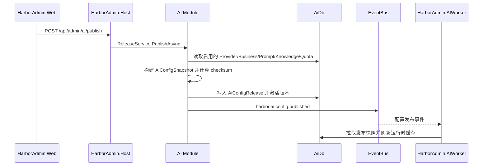

# HarborAdmin.Modules.AI

AI 平台管理模块：负责供应商、模型、Prompt、知识库、AI 业务、供应商路由、配额、配置发布、调用观测和管理端 Chat 调试。

本模块维护的是 AI 运行时配置草稿和发布快照。真正的模型调用执行由 `HarborAdmin.AIWorker` 完成；Host 通过本模块提供管理端
HTTP API，并在发布后通过事件通知 Worker 热加载新配置。

## 职责边界

| 子域            | 路径                                                               | 职责                                        |
|---------------|------------------------------------------------------------------|-------------------------------------------|
| Provider      | `Application/Services/Provider`、`Controllers/Provider`           | AI 供应商、模型、密钥引用、适配器配置                      |
| Business      | `Application/Services/Business`、`Controllers/Business`           | AI 业务入口、Prompt/Knowledge 绑定、路由、结构化输出和工具选项 |
| Prompt        | `Application/Services/Prompt`、`Controllers/Prompt`               | System/User Prompt 管理与版本字段                |
| KnowledgeBase | `Application/Services/KnowledgeBase`、`Controllers/KnowledgeBase` | 知识库内容与检索选项                                |
| Quota         | `Application/Services/Quota`、`Controllers/Quota`                 | 供应商级、模型级限额配置                              |
| Release       | `Application/Services/Release`、`Controllers/Release`             | 草稿快照发布、回滚、发布历史、事件通知                       |
| Observability | `Application/Services/Observability`、`Controllers/Observability` | 调用日志和用量流水查看                               |
| Chat          | `AiChatStreamService`、`Controllers/Chat`                         | 管理端 Chat SSE 调试通道                         |

AI 模块不直接执行模型请求；它把运行时所需的配置发布成 `AiConfigSnapshot`，由 AIWorker 消费。

## HTTP API 路由

| 路由                                           | 方法               | 说明                    |
|----------------------------------------------|------------------|-----------------------|
| `/api/admin/ai/providers`                    | `GET` / `POST`   | 列出、创建供应商              |
| `/api/admin/ai/providers/{id}`               | `PUT` / `DELETE` | 更新、删除供应商              |
| `/api/admin/ai/providers/{providerId}/quota` | `GET` / `PUT`    | 获取、保存供应商限额            |
| `/api/admin/ai/businesses`                   | `GET` / `POST`   | 列出、创建 AI 业务           |
| `/api/admin/ai/businesses/{id}`              | `PUT` / `DELETE` | 更新、删除 AI 业务           |
| `/api/admin/ai/prompts`                      | `GET` / `POST`   | 列出、创建 Prompt          |
| `/api/admin/ai/prompts/{id}`                 | `PUT` / `DELETE` | 更新、删除 Prompt          |
| `/api/admin/ai/knowledge-bases`              | `GET` / `POST`   | 列出、创建知识库              |
| `/api/admin/ai/knowledge-bases/{id}`         | `PUT` / `DELETE` | 更新、删除知识库              |
| `/api/admin/ai/model-quotas`                 | `GET` / `POST`   | 列出、创建模型限额             |
| `/api/admin/ai/model-quotas/{id}`            | `PUT` / `DELETE` | 更新、删除模型限额             |
| `/api/admin/ai/publish`                      | `POST`           | 发布当前 AI 草稿配置          |
| `/api/admin/ai/releases`                     | `GET`            | 列出发布历史                |
| `/api/admin/ai/published?version=0`          | `GET`            | 获取已发布快照，`0` 表示当前激活/最新 |
| `/api/admin/ai/releases/{version}/rollback`  | `POST`           | 回滚到指定版本               |
| `/api/admin/ai/invocations`                  | `GET`            | 查看调用日志                |
| `/api/admin/ai/usage`                        | `GET`            | 查看用量流水（兼容旧接口）         |
| `/api/admin/ai/usage/overview`               | `GET`            | 用量概览 KPI                |
| `/api/admin/ai/usage/summary`                | `GET`            | 用量聚合明细分页                |
| `/api/admin/ai/chat/stream`                  | `POST`           | 管理端 SSE Chat 调试       |

删除接口返回 `ApiResult.Ok(true)`，保持前端统一响应包约定。`chat/stream` 是 SSE 例外，直接写 `text/event-stream`。

## 数据模型

| 实体                                               | 表达内容                                   |
|--------------------------------------------------|----------------------------------------|
| `AiProvider`、`AiProviderModel`                   | 供应商与模型能力、价格、流式支持、密钥引用                  |
| `AiBusiness`、`AiBusinessProviderRoute`           | AI 业务入口、权限开关、Prompt/Knowledge 绑定、供应商路由 |
| `AiPrompt`                                       | Prompt 模板与变量配置                         |
| `AiKnowledgeBase`                                | 知识库内容与检索配置                             |
| `AiProviderQuota`、`AiModelQuota`、`AiQuotaBucket` | 供应商、模型和运行时桶限额                          |
| `AiConfigRelease`                                | 已发布 AI 运行时配置快照                         |
| `AiInvocationLog`、`AiUsageLedger`                | 调用日志与用量流水（`AiUsageLedger` 暂未启用写入）      |
| `AiQuotaBucket`                                | 运行时配额窗口桶；管理端用量报表从此聚合                 |

AI 模块实体归属模块自身边界；跨模块不要直接引用 Domain / Infrastructure。运行时消费使用发布快照或客户端契约。

## 发布流程



发布只包含启用状态的配置。ProviderQuota 快照会补充供应商业务 key，避免 Worker 运行时再做管理表关联。

## Secret 与供应商密钥

供应商通过 `SecretRef` 引用 `Modules.Secrets` 中保存的密钥：

- 保存供应商时会校验 `SecretRef` 是否存在且启用。
- 保存时固定当前 `SecretVersion`。
- 发布快照只保存 `SecretRef` 和版本信息，不保存明文。
- AIWorker 运行时通过 Secret 解析能力获取明文。

这种设计避免模型供应商密钥进入 AI 模块 DTO、日志或发布快照明文。

## Chat 调试

管理端 Chat 通过 `/api/admin/ai/chat/stream` 中转 AIWorker 的 SSE 流：

- Host 生成 `InvocationId` / `CorrelationId`。
- 请求被转换为 `AiBusinessRequest`。
- `BusinessKey` 为空时直接返回 SSE `error` 事件。
- 浏览器主动断开时吞掉取消异常。
- 非预期异常返回统一 SSE 错误事件。

## 模块结构

```text
Application/
  Abstractions/     # IAiProviderRepository、IAiBusinessRepository、IAiReleaseRepository 等窄仓储接口
  Mappings/         # DTO / Snapshot 映射
  Services/
    Provider/       # 供应商与模型
    Business/       # AI 业务与路由
    Prompt/         # Prompt
    KnowledgeBase/  # 知识库
    Quota/          # 限额
    Release/        # 发布与回滚
    Observability/  # 日志与用量
    Shared/         # 上下文、规范化工具
Contracts/
  Provider/ Business/ Prompt/ KnowledgeBase/ Quota/ Release/ Observability/ Chat/
  Shared/           # Constant、Dto、Snapshot
Controllers/
  Provider/ Business/ Prompt/ KnowledgeBase/ Quota/ Release/ Observability/ Chat/
Domain/
  Entities/
Infrastructure/
  Contexts/
  Repositories/
```

## 依赖注册

组合根通过 `AddHarborModules(...)` 扫描 `AiStartUp` 注册模块。`AiStartUp` 同时声明模块默认数据库 `AdminDb`：

| 生命周期      | 服务                                                   |
|-----------|------------------------------------------------------|
| Singleton | `IAiDbContext`                                       |
| Scoped    | 各窄领域仓储、各子域 Service、`AiChatStreamService`             |

发布事件依赖 `IEventPublisher`；Chat 调试依赖 `IAiStreamingClient`；供应商密钥校验依赖 `ISecretStore`。AIWorker 通过 `HarborModuleRegistrationContext.HostKind` 跳过 `AiChatStreamService` 注册，避免 Worker 依赖 Host 的 Chat 客户端服务。

## 权限种子

`Infrastructure/Seeds/ai-usage-permissions.sql` 为用量页注册 `overview` / `summary` API，并将筛选项所需的 `GET /api/admin/ai/businesses`、`GET /api/admin/ai/providers` 绑定到 `ai.usage.list`。执行种子后会递增 `AdminSessionVersion`（`VersionKey = 'global'`），**需重启 Host 并重新登录**后权限与字段策略才会生效。

## 开发注意事项

- Controller 保持薄适配，普通 JSON 接口只返回 `ApiResult.Ok(...)`。
- `chat/stream` 是 SSE 端点，不包 `ApiResult<T>`。
- Provider 保存时必须校验 Secret 并固定版本，避免发布后密钥版本漂移。
- Provider 模型至少保留一个，且同一供应商下只允许一个默认模型。
- 发布快照写库成功后再发事件；事件失败不回滚已发布快照。
- 业务路由、Prompt、Knowledge、Quota 的草稿变更不会影响运行时，必须发布后才生效。
