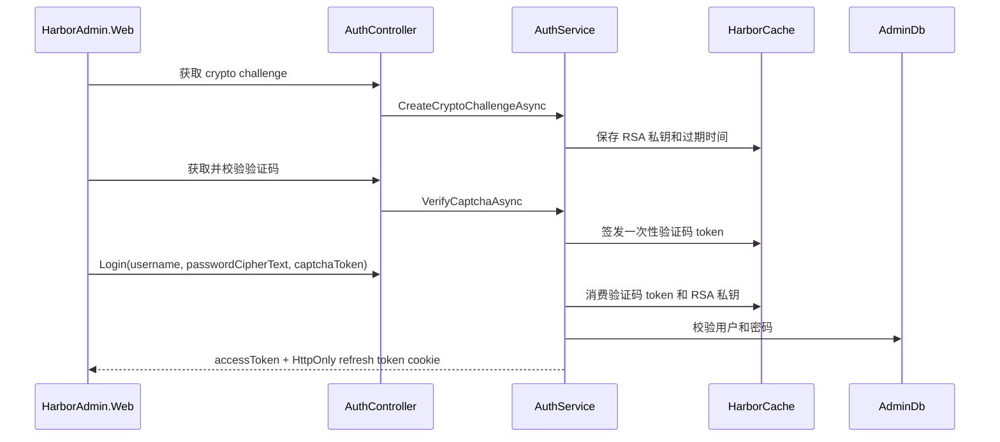

# HarborAdmin.Modules.Admin

管理后台核心模块：负责登录认证、验证码、访问控制、用户/角色/菜单/部门、缓存运维、功能设计元数据和动态 CRUD 运行通道。

本模块是 HarborAdmin 后台基础能力的组合模块。Host 负责 HTTP 管道、安全中间件和模块装配；Admin 模块负责管理后台领域能力和控制器。

## 职责边界

| 子域 | 路径 | 职责 |
|------|------|------|
| Auth | `Application/Services/Auth`、`Controllers/Auth` | RSA 登录挑战、验证码校验、登录、刷新令牌、登出 |
| Captcha | `Application/Services/Captcha`、`Application/Captcha` | 点选、滑块、旋转、文字验证码生成与校验 |
| Access | `Application/Services/Access`、`Controllers/Access` | 当前用户、菜单、权限、字段策略、数据范围、API 授权 |
| System | `Application/Services/{User,Role,Menu,Dept,System}`、`Controllers/System` | 用户、角色、菜单、部门、缓存管理 |
| FeatureDesign | `Application/Services/FeatureDesign`、`Controllers/FeatureDesign` | 功能、字段、动作、API 元数据设计 |
| Metadata | `Application/Services/Metadata`、`Controllers/Metadata` | 运行时 Feature Schema |
| DynamicCrud | `Application/Services/DynamicCrud`、`Controllers/DynamicCrud` | 基于 Feature 元数据的数据查询入口 |

Host 中间件不直接引用 `UserService`、`RoleService` 等具体业务服务；访问控制通过 `IAdminPrincipalResolver`、`IAdminApiAccessEvaluator` 等窄接口调用模块能力。

## HTTP API 路由

| 前缀 | 说明 |
|------|------|
| `/api/auth/*` | 匿名认证：加密挑战、验证码、登录、刷新、登出 |
| `/api/admin/access/*` | 当前用户、菜单、权限、Session、字段策略 |
| `/api/admin/system/user/*` | 用户管理 |
| `/api/admin/system/role/*` | 角色、菜单权限、按钮权限、字段策略、数据范围 |
| `/api/admin/system/menu/*` | 菜单、路由、权限树、排序 |
| `/api/admin/system/dept/*` | 部门树 |
| `/api/admin/system/cache/*` | 缓存查看、失效、诊断 |
| `/api/admin/feature-design/*` | 功能设计工作台 |
| `/api/admin/features/*` | 运行时元数据 Schema |
| `/api/admin/dynamic-crud/*` | 动态 CRUD 查询通道 |

普通 JSON 接口返回 `ApiResult.Ok(...)`。删除接口返回 `ApiResult.Ok(true)`，保持前端统一响应包约定。

## 认证与 Token

登录流程：



开发环境允许明文密码回退；非开发环境必须使用 RSA 加密挑战传输密码。

## 访问控制

访问控制使用 `AccessCacheService` 构建用户访问快照：

- `SessionVersion` 是全局权限版本，用户、角色、菜单、部门变更后递增。
- 用户快照包含权限码、菜单、角色、数据范围和字段策略。
- 超级管理员拥有全部启用 Action 和全部启用菜单。
- 普通用户按启用角色合并菜单、权限、字段策略和数据范围。
- `DataScopeType=All` 返回 `null`，表示不限制部门。

API 授权通过 `AdminApiAccessEvaluator` 将请求路径匹配到 Feature API，再根据 Action 与角色权限判断是否允许访问。

## 系统管理

| 能力 | 关键点 |
|------|--------|
| 用户 | 支持部门、角色、启用状态、超级管理员标记、字段策略脱敏 |
| 角色 | 同步菜单、权限码、字段策略、数据范围 |
| 菜单 | 支持目录、菜单、按钮，绑定 Feature 和权限码，生成后端路由 |
| 部门 | 树形组织结构，删除前校验子部门和用户 |
| 缓存 | 查看缓存 Provider、模型、Tag、Key，并支持失效 |

用户、角色、菜单、部门变更后都会 bump session version，确保访问缓存失效。

## 功能设计与动态 CRUD

FeatureDesign 子域维护后台动态能力元数据：

- Feature：业务功能定义。
- Field：字段、组件、显示、校验、选项。
- Action：按钮/操作权限。
- API：接口路径和方法。
- ActionApi：操作与 API 的绑定关系。

Metadata 子域把 Feature 元数据转换为前端可消费的运行时 schema。DynamicCrud 子域基于 schema 和动态资源处理器执行数据查询。

## 模块结构

```text
Application/
  Abstractions/       # Host 窄接口、Repository、动态资源处理器接口
  Captcha/            # 验证码生成器
  Mappings/           # DTO 映射
  Services/
    Auth/             # 登录、刷新、登出
    Access/           # 访问控制、Session、字段策略
    User/ Role/ Menu/ Dept/
    FeatureDesign/
    Metadata/
    DynamicCrud/
    System/           # 缓存管理
Contracts/
  Auth/ Access/ Captcha/ System/ FeatureDesign/ DynamicCrud/
Controllers/
  Auth/ Access/ System/ FeatureDesign/ Metadata/ DynamicCrud/
Domain/
  Entities/
Infrastructure/
  Caching/ Contexts/ Options/ Repositories/ Resolvers/ Security/
```

## 依赖注册

组合根通过 `AddHarborModules(...)` 扫描 `AdminStartUp` 注册模块。`AdminStartUp` 同时声明模块默认数据库 `AdminDb`，并按分组注册：

| 分组 | 注册内容 |
|------|----------|
| Infrastructure | `IAdminDbContext`、Auth / Dictionary / User / Menu / Access / FeatureDesign 等窄仓储、Token、验证码图片池、上下文、动态资源解析器 |
| Auth | `AuthService` |
| Access | 访问缓存、Principal、API 授权、Session、字段策略 |
| SystemManagement | 菜单、部门、角色、用户、缓存管理 |
| FeatureDesign | Feature、Field、Action、API 元数据服务 |
| DynamicCrud | `AdminDynamicCrudService` |

## 开发注意事项

- Controller 保持薄适配，失败通过领域异常交给 Host 过滤器处理。
- 用户、角色、菜单、部门、Feature 权限相关变更后必须 bump 或失效访问缓存。
- 超级管理员标记只能由当前超级管理员设置。
- 菜单和部门父级变更必须防止循环引用。
- 角色保存时菜单、权限、字段策略、数据范围按请求整体同步。
- Token、验证码、密码、refresh token 相关逻辑不要输出敏感明文到日志或 DTO。
