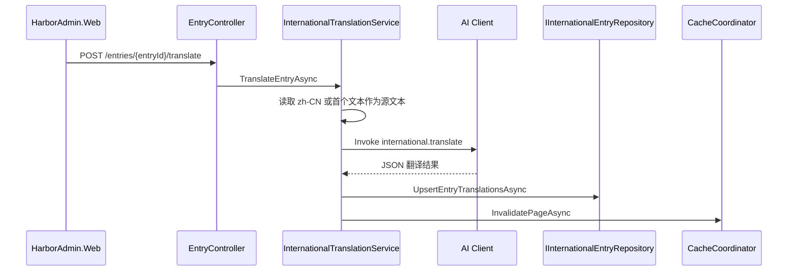

# HarborAdmin.Modules.International

前端运行时国际化模块：负责页面命名空间、树形语言条目、多语言文本、页面版本发布、运行时资源包生成，以及 AI 辅助翻译结果回写。

本模块面向 HarborAdmin.Web 管理端运行时 i18n。它把前端页面语言资源维护成可发布、可缓存、可按页面拉取的后台能力。

## 职责边界

| 层次             | 路径                                                                           | 职责                |
|----------------|------------------------------------------------------------------------------|-------------------|
| Page           | `Controllers/Page`、`Application/Services/InternationalPageService.cs`        | 页面命名空间维护、版本发布     |
| Entry          | `Controllers/Entry`、`Application/Services/InternationalEntryService.cs`      | 页面内树形条目维护、多语言文本维护 |
| Resource       | `Controllers/Resource`、`InternationalResourceBundleService.cs`               | 运行时版本与资源包读取       |
| Translation    | `InternationalTranslationService.cs`、`InternationalTranslationSubscriber.cs` | AI 翻译请求、回调结果应用    |
| Infrastructure | `Infrastructure/Repositories`、`Infrastructure/Caching`                       | FreeSql 持久化与缓存模型  |

其他模块不要直接引用 International 的 Domain 或 Infrastructure。运行时前端通过资源 API 拉取 bundle；后台管理通过 Page /
Entry API 修改资源。

## HTTP API 路由

| 路由                                                           | 方法       | 说明          |
|--------------------------------------------------------------|----------|-------------|
| `/api/admin/international/pages`                             | `GET`    | 列出页面            |
| `/api/admin/international/pages/tree`                        | `GET`    | 列出页面分组树      |
| `/api/admin/international/pages`                             | `POST`   | 创建页面命名空间    |
| `/api/admin/international/pages/{id}`                        | `PUT`    | 更新页面命名空间    |
| `/api/admin/international/pages/{id}`                        | `DELETE` | 删除页面及全部条目   |
| `/api/admin/international/pages/{id}/publish`                | `POST`   | 发布页面版本      |
| `/api/admin/international/pages/{pageId}/entries`            | `GET`    | 获取页面条目树     |
| `/api/admin/international/pages/{pageId}/entries`            | `POST`   | 创建页面条目      |
| `/api/admin/international/pages/entries/{entryId}`           | `PUT`    | 更新条目        |
| `/api/admin/international/pages/entries/{entryId}`           | `DELETE` | 删除条目及子树     |
| `/api/admin/international/pages/entries/{entryId}/translate` | `POST`   | 请求 AI 翻译条目  |
| `/api/admin/international/resources/version`                 | `GET`    | 获取全局版本与页面版本 |
| `/api/admin/international/resources/bundle`                  | `GET`    | 获取全量资源包     |
| `/api/admin/international/resources/pages/bundle?path=...`   | `GET`    | 获取单页面资源包    |

删除接口返回 `ApiResult.Ok(true)`，保持前端统一响应包约定。

## 数据模型

| 实体                              | 基类                | 表达内容                        |
|---------------------------------|-------------------|-----------------------------|
| `InternationalGroup`            | `AuditableEntity` | 前端模块/子视图分组，例如 `config-center/workspace` |
| `InternationalPage`             | `AuditableEntity` | 前端页面完整路径，例如 `config-center/workspace/items` |
| `InternationalEntry`            | `AuditableEntity` | 页面内树形 i18n 节点               |
| `InternationalEntryTranslation` | `EntityBase`      | 条目在指定 locale 下的文本           |

实体当前归属 `AdminDb`。模块独立于 Admin 的业务边界，数据库归属不代表可以跨模块直接引用实体。

## 资源包结构

页面资源会合并成前端可直接使用的消息对象：

```json
{
  "zh-CN": {
    "config-center": {
      "application": {
        "name": "应用名称"
      }
    }
  },
  "en-US": {
    "config-center": {
      "application": {
        "name": "Application name"
      }
    }
  }
}
```

构建规则：

- `FullPath` 与前端 `views` / `locales` 路径同构，并作为资源包路径。
- `PageKey` 是 `FullPath` 的末段，仅用于页面实体内的短键名。
- 条目通过 `ParentId` 形成树形对象。
- 叶子节点使用对应 locale 的翻译值。
- 目标 locale 缺失时回退到默认语言 `zh-CN`。
- 条目键名禁止包含 `.`, `:`, `/`，避免与前端路径和配置层级语义冲突。

## 版本与缓存

`InternationalResourceBundleService` 使用缓存模型读取版本与资源包：

- `GetVersionAsync` 返回全局版本和每个页面版本。
- `GetBundleAsync` 返回全量资源包。
- `GetPageBundleAsync` 返回单页面资源包。
- 页面、条目、翻译发生变化后通过 `InternationalCacheCoordinator` 失效全局和页面缓存。
- 发布页面版本会递增页面版本并失效相关缓存。

缓存 key 和 tag 定义在 `Infrastructure/Caching/InternationalCacheKeys.cs`。

## AI 翻译流程



AI 返回内容会从首个 `{` 到最后一个 `}` 截取 JSON 对象，解析为 `locale -> translation` 字典，再按 locale 覆盖写入条目翻译。

## 模块结构

```text
Application/
  Abstractions/     # Page、Group、Entry、Version 窄仓储接口
  Mappings/         # DTO 映射
  Services/         # Page、Entry、ResourceBundle、Translation、CacheCoordinator、BundleBuilder
Contracts/
  Page/             # 页面 DTO / Request
  Entry/            # 条目 DTO / Request
  Resource/         # 运行时资源 DTO
Controllers/
  Page/             # 页面管理 API
  Entry/            # 条目和 AI 翻译 API
  Resource/         # 运行时资源 API
Domain/
  Entities/         # InternationalPage、InternationalEntry、InternationalEntryTranslation
Infrastructure/
  Caching/          # 缓存模型与 key
  Contexts/         # InternationalDbContext
  Repositories/     # FreeSql 仓储实现
```

## 依赖注册

组合根通过 `AddHarborModules(...)` 扫描 `InternationalStartUp` 注册模块。`InternationalStartUp` 同时声明模块默认数据库 `AdminDb`：

| 生命周期      | 服务                                                                                                                                                            |
|-----------|---------------------------------------------------------------------------------------------------------------------------------------------------------------|
| Singleton | `IInternationalDbContext`                                                                                                                                       |
| Scoped    | Page、Group、Entry、Version 窄仓储、`InternationalCacheCoordinator`、页面、条目、资源包与 AI 翻译服务                                                                    |

AI 翻译依赖 `IAiClient`，需要 Host 同时注册 AI Client 相关能力。

## 开发注意事项

- Controller 保持薄适配，只返回 `ApiResult.Ok(...)`。
- 页面 key 变化时必须同时失效旧 key 和新 key 的页面缓存。
- 条目树删除必须删除整棵子树及其翻译，避免孤立翻译。
- Bundle 构建必须保留默认语言回退，避免目标语言未翻译时前端显示空白。
- AI 翻译结果只能作为辅助写入，解析失败或空结果不应破坏现有翻译。
