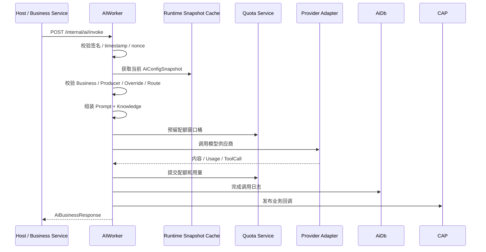

# HarborAdmin.AIWorker

AIWorker 是 HarborAdmin 的 AI 执行进程：负责消费 AI 模块发布的运行时快照，校验内部调用签名，组装 Prompt / Knowledge
上下文，执行模型供应商调用，处理配额、回退、调用日志、用量统计和业务回调。

管理端配置仍由 `HarborAdmin.Host` + `HarborAdmin.Modules.AI` 维护；AIWorker 只消费已发布快照，不直接提供管理端 CRUD。

## 职责边界

| 组件                            | 职责                        |
|-------------------------------|---------------------------|
| `HarborAdmin.Modules.AI`      | AI 配置草稿、发布快照、调用日志和用量表结构   |
| `HarborAdmin.AIWorker`        | 执行已发布配置、调用供应商、配额扣减、内部 API |
| `HarborAdmin.Modules.Secrets` | 供应商密钥和业务签名密钥解析            |
| CAP / RabbitMQ                | AI 配置发布事件与业务回调事件          |
| ConfigCenter Client           | Worker 启动配置和热更新配置来源       |

AIWorker 对外只暴露内部调用 API，面向 Host 或可信业务服务，不承载管理后台页面。

## HTTP API

| 路由                    | 方法     | 说明              |
|-----------------------|--------|-----------------|
| `/internal/ai/invoke` | `POST` | 执行非流式 AI 调用     |
| `/internal/ai/stream` | `POST` | 执行 SSE 流式 AI 调用 |

请求体为 `AiBusinessRequest`。请求会先经过签名校验，再进入 `AiExecutionService`。

## 调用链路



流式调用使用相同准备流程，但 Provider 结果通过 SSE `AiStreamEvent` 逐步返回。

## 运行时快照

`AiRuntimeConfigCache` 负责缓存当前发布快照：

- 启动时加载最新发布。
- 首次调用时若缓存为空，会自动加载最新发布。
- 收到 `harbor.ai.config.published` 事件后按 `releaseId` 热加载。
- 热加载失败时保留旧快照，避免新发布损坏导致 Worker 立即不可用。

配置变更必须先在 `HarborAdmin.Modules.AI` 发布，Worker 才会使用新配置。

## 签名校验

`AiRequestSignatureValidator` 使用业务配置中的 `SigningSecretRef` 校验内部调用：

| Header                  | 说明                                   |
|-------------------------|--------------------------------------|
| `X-Harbor-AI-Key`       | Producer Key，必须与请求体 `ProducerKey` 一致 |
| `X-Harbor-AI-Timestamp` | Unix 秒级时间戳，允许 5 分钟偏差                 |
| `X-Harbor-AI-Nonce`     | 防重放随机值                               |
| `X-Harbor-AI-Signature` | HMAC 签名                              |

Worker 会在内存中记录已见 nonce，过期后清理。签名密钥通过 `ISecretResolver` 从 Secrets 模块解析。

## Prompt 与 Knowledge

`AiPromptComposer` 将运行时快照和请求组装为供应商消息：

- 校验 Prompt 必填变量。
- 合并系统 Prompt、请求覆盖 Prompt。
- 按业务配置决定是否追加或覆盖 Knowledge。
- 生成引用信息 `AiReference`。
- 估算上下文长度，供业务 `MaxContextTokens` 和配额预留使用。

如果业务配置不允许覆盖模型、Prompt、Knowledge 或 ProviderOptions，Worker 会在调用前拒绝请求。

## 路由、回退与重试

`AiExecutionService` 按业务路由优先级依次尝试供应商：

- 路由校验失败时跳过当前路由并记录 fallback trace。
- 可恢复供应商错误会按供应商 `MaxRetryCount` 重试。
- 重试后仍失败且未向客户端输出内容时，可继续尝试下一条路由。
- 不可回退错误会终止调用并写入失败日志。
- 流式调用一旦已经向客户端输出 delta，就不再切换供应商，避免混合多个模型输出。

## 配额

`AiQuotaService` 使用窗口桶预留和提交机制：

- 调用前按 ProviderQuota / ModelQuota 构建分钟、天、月窗口。
- 预留阶段增加 `ReservedRequests`。
- 成功后扣减预留并累计成功次数、Token 和成本。
- 失败后扣减预留并累计失败次数。
- 调用取消或供应商回退时释放预留，不累计成功/失败。

窗口桶使用 Serializable 工作单元，避免并发请求突破限额。

## Provider Adapter

当前注册的供应商适配器：

| AdapterType                      | 实现                                   |
|----------------------------------|--------------------------------------|
| `openai-chat-completions`        | `OpenAiChatCompletionsAdapter`       |
| `openai-responses`               | `OpenAiResponsesAdapter`             |
| `google-gemini-generate-content` | `GoogleGeminiGenerateContentAdapter` |

适配器负责把统一的 `AiProviderCallRequest` 转为供应商请求，并把响应转换为统一的 `AiProviderCallResult` 或
`AiStreamEvent`。

## 项目结构

```text
services/HarborAdmin.AIWorker/
  Program.cs                         # 组合根、ConfigCenter、CAP、adapter 注册
  Controllers/
    InternalAiController.cs          # 内部 invoke / stream API
  Application/
    AiExecutionService.cs            # AI 调用主编排
    AiPromptComposer.cs              # Prompt / Knowledge 消息组装
    AiQuotaService.cs                # 配额预留与提交
    AiRuntimeConfigCache.cs          # 发布快照缓存
    AiRequestSignatureValidator.cs   # 内部请求签名校验
    AiConfigPublishedSubscriber.cs   # 配置发布事件订阅
  Infrastructure/
    IAiProviderAdapter.cs
    OpenAiChatCompletionsAdapter.cs
    OpenAiResponsesAdapter.cs
    GoogleGeminiGenerateContentAdapter.cs
    AiProviderAdapterResolver.cs
```

## 开发注意事项

- 不要在 Worker 中增加管理端 CRUD；配置管理属于 `Modules.AI`。
- 不要把 Provider API Key 写入日志、DTO 或发布快照明文。
- 修改签名算法时必须同步调用方的 `AiRequestSigner`。
- 修改发布快照结构时必须同步 `Modules.AI` 的 Snapshot 契约和 Worker 解析逻辑。
- 流式调用已经输出内容后不要切换供应商。
- Provider 适配器必须把供应商错误转换为 `AiProviderException`，方便统一分类、重试和回退。
