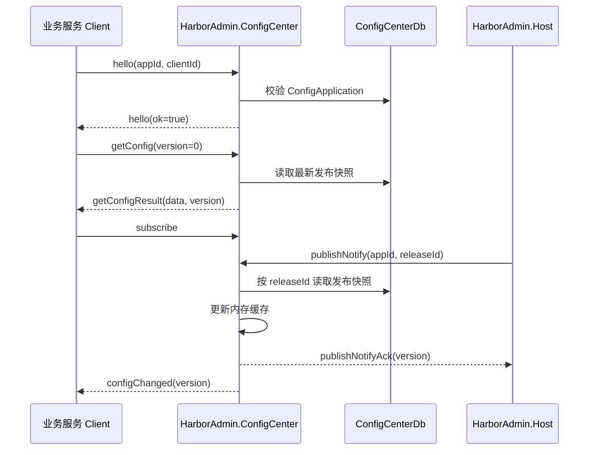

# HarborAdmin.ConfigCenter

配置中心核心 TCP 服务：负责按应用读取已发布配置快照、维护进程内最新快照缓存、接收 Host 发布通知，并向已订阅客户端广播配置变更。

该服务是独立进程，只提供 TCP JSON 协议，不承载 HTTP API，不引入 Kestrel。管理端应用、草稿配置项和发布操作由
`HarborAdmin.Host` 加载 `HarborAdmin.Modules.ConfigCenter` 后提供。

## 职责边界

| 组件                                 | 职责                                           |
|------------------------------------|----------------------------------------------|
| `HarborAdmin.Host`                 | 管理端 HTTP API，写入草稿与发布快照，发布后发送 `publishNotify` |
| `HarborAdmin.Modules.ConfigCenter` | 应用、配置项、发布记录、快照读取等业务能力                        |
| `HarborAdmin.ConfigCenter`         | TCP 读服务、快照缓存、订阅连接管理、配置变更广播                   |
| `HarborAdmin.ConfigCenter.Client`  | 业务服务侧配置拉取、订阅与 `IConfiguration` 热更新           |

`HarborAdmin.ConfigCenter` 默认只读消费发布快照。Host 与本服务必须指向同一个 `ConfigCenterDb`，否则 Host 发布后，本服务无法读取对应快照。

## TCP 协议

协议消息定义在 `client/HarborAdmin.Client.ConfigCenter/Protocol`。帧格式为：

```text
4 字节大端 payload 长度 + UTF-8 JSON payload
```

| 消息类型               | 方向                    | 说明                                |
|--------------------|-----------------------|-----------------------------------|
| `hello`            | Client -> Server      | 声明 `appId`、`clientId`，服务端校验应用是否存在 |
| `getConfig`        | Client -> Server      | 拉取指定版本配置；`version=0` 表示最新版本       |
| `getConfigResult`  | Server -> Client      | 返回扁平化配置字典                         |
| `subscribe`        | Client -> Server      | 订阅当前 `appId` 的配置变更                |
| `configChanged`    | Server -> Client      | 配置发布后推送新版本号                       |
| `publishNotify`    | Host -> Server        | Host 发布成功后通知本服务刷新缓存               |
| `publishNotifyAck` | Server -> Host        | 确认发布通知已处理                         |
| `ping` / `pong`    | 双方                    | 心跳                                |
| `error`            | Server -> Client/Host | 协议或业务错误                           |

客户端必须先发送 `hello`，再执行 `getConfig` 或 `subscribe`。`publishNotify` 是 Host 短连接使用的内部消息。

## 运行流程



## 缓存策略

`PublishedConfigCache` 只缓存最新版本快照：

- `getConfig(version=0)` 优先读取内存缓存，未命中时从数据库加载最新发布快照。
- `getConfig(version>0)` 直接按版本从数据库读取，不污染最新版本缓存。
- `publishNotify` 到达后按 `releaseId` 刷新最新版本缓存。
- 如果刷新后没有快照，会移除当前应用缓存，避免继续返回旧数据。

快照读取使用 resolved 版本，Secret 引用只在内存中解析为明文，不会把明文写回数据库。

## 服务结构

```text
services/HarborAdmin.ConfigCenter/
  Program.cs                         # 进程入口、DI、数据库配置与 TCP HostedService
  Tcp/
    ConfigCenterTcpHostedService.cs  # TCP 监听与连接作用域创建
    ConfigCenterConnectionHandler.cs # 单连接协议处理
    PublishedConfigCache.cs          # 已发布快照内存缓存
    ConfigSubscriptionHub.cs         # 订阅连接注册与广播
    ConfigChangeNotifier.cs          # 发布后刷新和广播封装
  appsettings.json                   # 默认本地配置
  appsettings.Development.json       # 开发环境配置
```

## 配置

核心配置节：

```json
{
  "ConfigCenter": {
    "Host": "0.0.0.0",
    "Port": 18100
  },
  "Harbor": {
    "YitterWorkId": 1,
    "DbConfig": {
      "Databases": [
        {
          "Key": "ConfigCenterDb",
          "DataType": "PostgreSQL",
          "ConnectionString": "Host=...;Password=${ENV:HARBORADMIN_DEV_POSTGRES_PASSWORD};...",
          "SyncStructure": true,
          "ReadOnly": false
        }
      ]
    }
  }
}
```

连接字符串支持 `${ENV:VARIABLE_NAME}` 占位符。启动时会把占位符替换为环境变量值；如果变量不存在，服务会启动失败，避免使用空密码或错误连接。

## 启动

```bash
cd services/HarborAdmin.ConfigCenter
dotnet run
```

本服务通常在基础设施启动后、`HarborAdmin.Host` 之前启动。Host 发布配置时会通过 TCP 连接本服务并发送 `publishNotify`。

## 开发注意事项

- 不要在本服务中添加 HTTP Controller；管理端 HTTP 能力属于 `HarborAdmin.Host` 和模块控制器。
- TCP 协议字段变更必须同步 `HarborAdmin.ConfigCenter.Client`。
- `hello` 阶段必须校验应用存在，避免未知 `appId` 长连接占用订阅表。
- 订阅广播失败时不在广播循环内强制关闭连接，由连接处理循环统一清理。
- 修改发布通知逻辑时，保持先刷新缓存、再回复 Host、再广播客户端的顺序。
- 数据库写入应由 Host 完成；本服务只读取发布快照并维护缓存。
